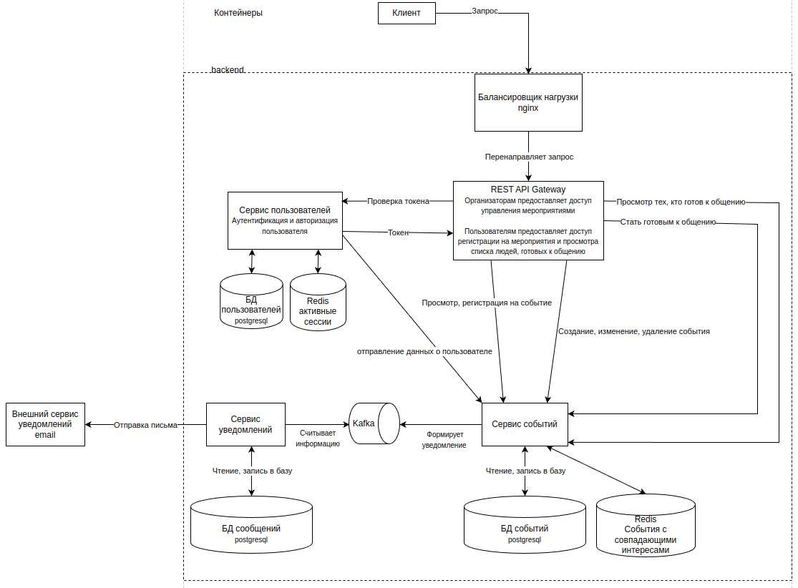

# Netevent
App for networking on events 
# Installation
```
git clone git@github.com:chudik63/netevent.git
cd netevent
```
# Main Commands
Build and start all containers:
```
docker-compose up
```

# Architecture


# Technologies Used
- Golang
- GRPC
- PostgreSQL
- Reddis
- Kafka
- Docker
